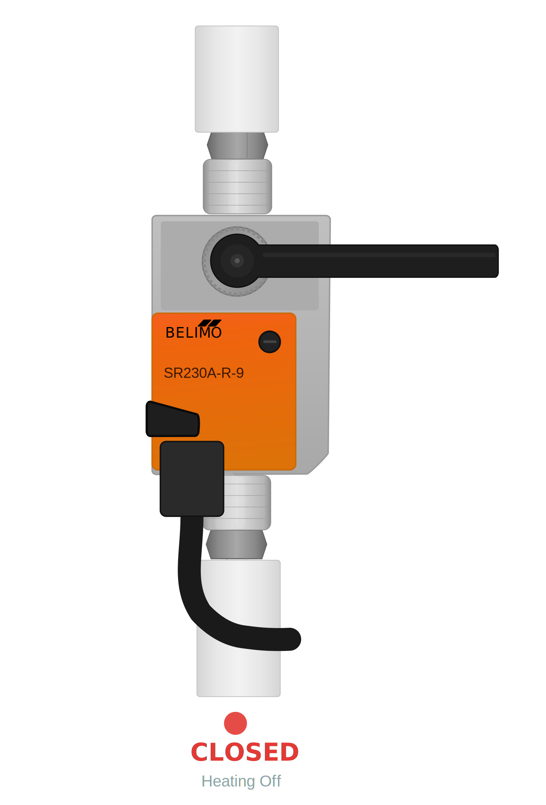
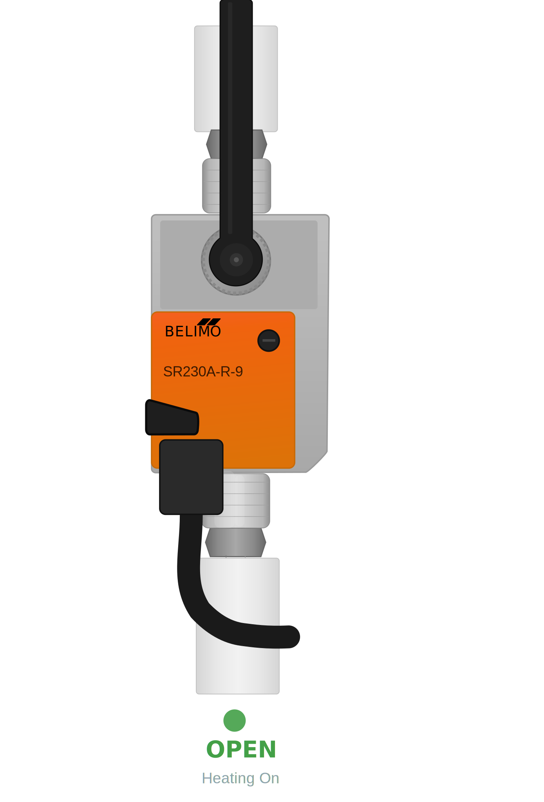

# Belimo SR230A-R Valve Monitoring for Home Assistant

Monitor whether your heating valve is open or closed in [Home Assistant](https://www.home-assistant.io/) using a **Belimo SR230A-R** actuator, a **Belimo S1A** auxiliary switch add-on, and a **Shelly 1 Mini Gen4**.


The lovelace Card created in this repo is then part of a bigger dashboard providing an overview of the whole heating sytem, driven by a Hoval Toptronic: https://github.com/vincentmakes/canbus_hoval  


### The lovelace card by itself (valve in open position), and the real valve (in closed position this time)


## Overview

The Belimo SR230A-R is a rotary actuator commonly used on ball valves in heating systems. It has no built-in position feedback — only a mechanical position indicator (the black handle). By adding the **Belimo S1A** auxiliary switch module, we get a dry contact that changes state based on valve position. A **Shelly 1 Mini Gen4** reads that contact and exposes it to Home Assistant as a binary sensor. The **Belimo S2A** is also an option in case the S1A is not available.

The result: a `binary_sensor` in HA that tells you whether your heating valve is open or closed, with custom SVG illustrations of the actual actuator.

## Hardware

| Component | Description | Approx. Cost |
|-----------|-------------|:------------:|
| [Belimo SR230A-R-9](https://www.belimo.com) | Rotary actuator (RetroFIT+), 20 Nm, AC 100–240 V, Open/Close, 3-point | (existing) |
| [Belimo S1A](https://www.belimo.com) | Auxiliary switch 1× SPDT, add-on for SR-A actuators | ~€50 |
| [Shelly 1 Mini Gen4](https://www.shelly.com/products/shelly-1-mini-gen4) | Compact smart relay — WiFi, Zigbee, Matter, Bluetooth | ~€15 |

### S1A Compatibility

The S1A is officially listed as a compatible electrical accessory in the [Belimo SR230A-R datasheet](https://www.belimo.com/mam/general-documents/datasheets/en-gb/belimo_SR230A-R_datasheet_en-gb.pdf) (accessories section, page 3–4). It clips directly onto the position indicator of the actuator housing.

## S1A Installation

The S1A attaches onto the **position indicator** (handle mechanism) of the SR230A-R actuator. The guiding grooves between the housing and the switch ensure a tight fit.

**Steps:**

1. **Power off** the actuator (de-energize the 230V supply)
2. Briefly remove the position indicator lever
3. Slide the S1A module into the grooves on the actuator housing
4. Reattach the position indicator lever
5. Set the switching point using the S1A adjustment dial
6. Power back on

> ⚠️ **Important**: All settings on the S1A must be done with the actuator de-energized. Since you are working near 230V mains wiring, installation should be performed by a qualified electrician.

### S1A Wiring Reference

The S1A has 3 wires:

| Wire | Color | Function |
|------|-------|----------|
| S1 | Violet | Common |
| S2 | Red | Normally Open (NO) |
| S3 | Grey | Normally Closed (NC) |

Use **S1** and **S2** (NO) if you want: contact closed = valve open.
Use **S1** and **S3** (NC) for the inverse logic.

## Wiring

The Shelly 1 Mini Gen4 is used purely as a **sensor** (not switching anything with the relay). The S1A dry contact passes mains voltage through to the Shelly's SW input when closed.

```
                    ┌─────────────────────────┐
                    │    Shelly 1 Mini Gen4    │
                    │                          │
Mains L ──────┬─────┤ L                        │
              │     │                          │
              │     │ N ─────────┬─────────── Mains N
              │     │            │             │
              │     │ SW ────┐   │             │
              │     │        │   │  (O and I   │
              │     └────────┼───┘   unused)   │
              │              │                 │
              │         S1A Contact            │
              │              │                 │
              │     S2 (Red) ┘                 │
              │                                │
              └──── S1 (Violet) ───────────────┘
                    S1A Aux Switch
```

**In plain terms:**

1. Power the Shelly: connect **Mains L → Shelly L** and **Mains N → Shelly N**
2. Wire the S1A: connect **Mains L → S1A S1 (Violet/Common)**
3. Bridge the contact to Shelly: connect **S1A S2 (Red/NO) → Shelly SW**

When the valve opens, the S1A contact closes, passing 230V from L to SW — the Shelly reads "on". When the contact opens, SW floats — the Shelly reads "off".

> ⚠️ **Safety**: You are routing mains 230V through the S1A contact. Use proper Wago connectors and keep all connections inside a junction box. The S1A contact is rated for 250V AC.

The **O** and **I** terminals on the Shelly are not used — those are for the relay output side.

## Shelly Configuration

After powering the Shelly and connecting it to your WiFi network:

1. Open the Shelly web interface or app
2. Go to **Settings → Input/Output Settings**
3. Set **Input mode** to **Switch** (not Button)
4. Set **Relay mode** to **Detached** — so the switch input is reported as a sensor only and doesn't toggle the relay

The Shelly integration in Home Assistant will auto-discover the device and expose the input as a `binary_sensor`.

## Home Assistant Configuration

### Template Sensor (optional but recommended)

Add this to your `configuration.yaml` to create a friendly sensor with a proper device class. Replace the entity ID with your actual Shelly input entity (check **Settings → Devices → Shelly 1 Mini Gen4**):

```yaml
template:
  - binary_sensor:
      - name: "Heating Valve"
        unique_id: belimo_heating_valve
        device_class: running
        state: >
          {{ is_state('binary_sensor.shelly_1_mini_gen4_input', 'on') }}
```

### SVG Illustrations

This project includes custom SVG illustrations of the Belimo SR230A-R-9 actuator showing the valve in open and closed positions.

1. Copy the SVG files to your HA `config/www/` folder:
   - `belimo_v8_open.svg`
   - `belimo_v8_closed.svg`

2. Files in `config/www/` are served under `/local/` in HA.

> **Tip**: If images don't appear, restart HA or clear your browser cache.

### Dashboard Card

Add this card to your dashboard via the YAML editor. This uses a `vertical-stack` with `card-mod` for styling:

```yaml
type: vertical-stack
cards:
  - type: picture-entity
    entity: binary_sensor.shelly_1_mini_gen4_input
    name: Heating Valve
    show_state: false
    show_name: false
    state_image:
      "on": /local/belimo_v8_open.svg
      "off": /local/belimo_v8_closed.svg
      unavailable: /local/belimo_v8_open.svg
      unknown: /local/belimo_v8_open.svg
    card_mod:
      style:
        .: |
          ha-card {
            background: rgba(200, 200, 200, 0.3);
          }
        hui-image $: |
          img {
            max-height: 400px !important;
            object-fit: contain !important;
          }
  - type: entities
    entities:
      - entity: binary_sensor.shelly_1_mini_gen4_input
        name: Valve Status
        icon: mdi:valve
      - type: attribute
        entity: binary_sensor.shelly_1_mini_gen4_input
        attribute: last_changed
        name: Since
        icon: mdi:clock-outline
        format: relative
  - type: history-graph
    entities:
      - entity: binary_sensor.shelly_1_mini_gen4_input
        name: Heating history
    hours_to_show: 24
    show_names: false
```

> **Note**: This card requires [card-mod](https://github.com/thomasloven/lovelace-card-mod) installed via [HACS](https://hacs.xyz/). If you don't want to install card-mod, remove the `card_mod:` section — the card will still work, just without the size/background customization.

#### Sections Dashboard

If you're using the newer **Sections** dashboard layout, `vertical-stack` works fine. Add the card via the YAML editor in the card picker dialog.

#### Card without card-mod

A simpler version that works without any custom components:

```yaml
type: vertical-stack
cards:
  - type: picture-entity
    entity: binary_sensor.shelly_1_mini_gen4_input
    show_state: false
    show_name: false
    state_image:
      "on": /local/belimo_v8_open.svg
      "off": /local/belimo_v8_closed.svg
      unavailable: /local/belimo_v8_open.svg
      unknown: /local/belimo_v8_open.svg
  - type: history-graph
    entities:
      - entity: binary_sensor.shelly_1_mini_gen4_input
        name: Heating
    hours_to_show: 24
    show_names: false
```

## Project Structure

```
belimo-ha-valve-monitor/
├── README.md
├── images/
│   ├── ha-card-preview.png        # Screenshot of the card in HA
│   ├── belimo-front.jpg           # Photo of the actual installation
│   ├── belimo-angle.jpg           # Photo from angle
│   └── belimo-closeup.jpg         # Close-up of the actuator label
├── svg/
│   ├── belimo_v8_open.svg         # Valve open illustration
│   └── belimo_v8_closed.svg       # Valve closed illustration
├── ha-config/
│   ├── card.yaml                  # Dashboard card YAML
│   ├── card-simple.yaml           # Card without card-mod dependency
│   └── template-sensor.yaml       # Template binary sensor
└── LICENSE
```

## Illustrations

The SVG illustrations are hand-crafted vector graphics based on the actual Belimo SR230A-R-9 installation. They show:

<table>
  <tr>
    <td align="center"><strong>Closed</strong></td>
    <td align="center"><strong>Open</strong></td>
  </tr>
  <tr>
    <td></td>
    <td></td>
  </tr>
</table>

- Handle horizontal (perpendicular to pipe) = **Closed** / Heating Off
- Handle vertical (aligned with pipe) = **Open** / Heating On
- Green flow arrows when open, red X when closed
- Accurate representation: orange Belimo body, grey housing, silver unions, white insulated pipe

## Automation Ideas

Once you have the valve state in HA, you can:

- **Notify** when heating turns on/off
- **Track** daily heating hours via the history integration
- **Correlate** heating activity with room temperature sensors
- **Dashboard** showing heating cost estimates based on run time
- **Alert** if heating hasn't turned on during cold weather (possible fault)

Example automation — notify when heating starts:

```yaml
automation:
  - alias: "Notify Heating On"
    trigger:
      - platform: state
        entity_id: binary_sensor.shelly_1_mini_gen4_input
        to: "on"
    action:
      - service: notify.mobile_app_your_phone
        data:
          title: "Heating"
          message: "Heating valve opened"
```

## Credits

- [Belimo](https://www.belimo.com) — SR230A-R actuator and S1A auxiliary switch
- [Shelly](https://www.shelly.com) — 1 Mini Gen4 smart relay
- [Home Assistant](https://www.home-assistant.io) — Home automation platform
- [card-mod](https://github.com/thomasloven/lovelace-card-mod) — Custom CSS styling for HA cards

## License

MIT License — see [LICENSE](LICENSE) for details.
